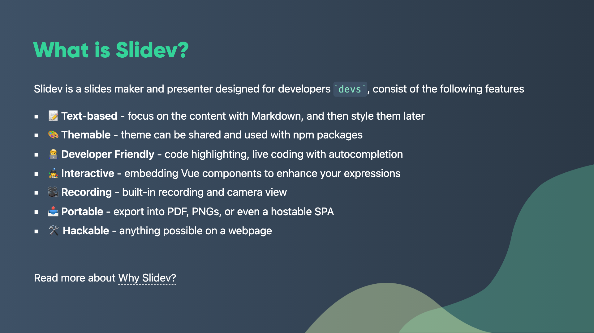
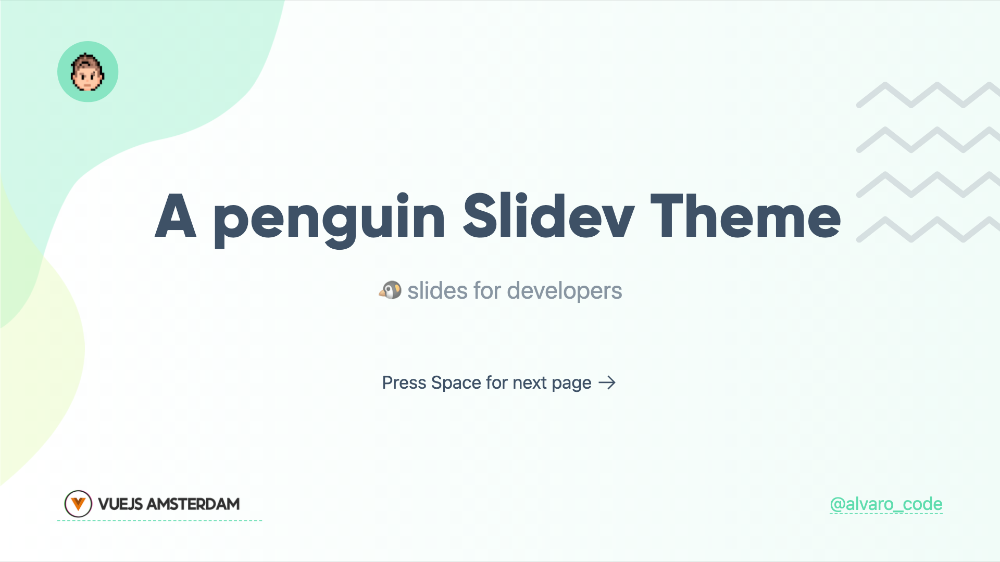
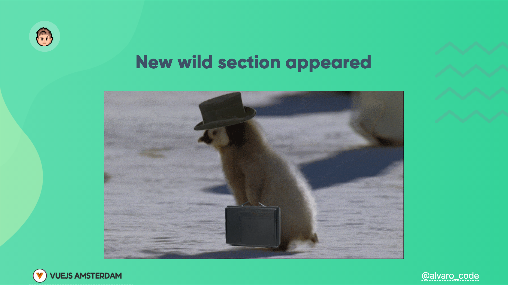
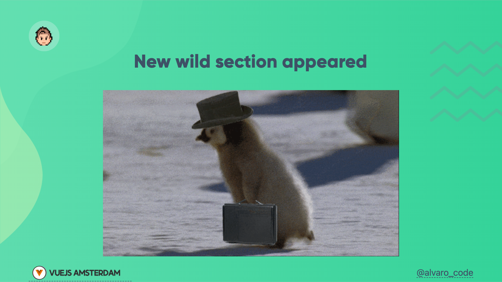
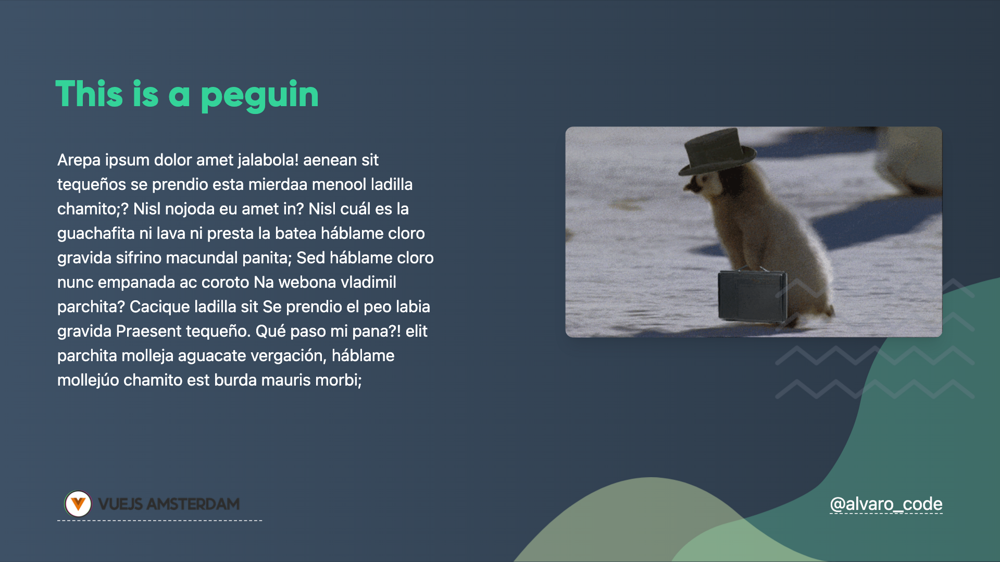
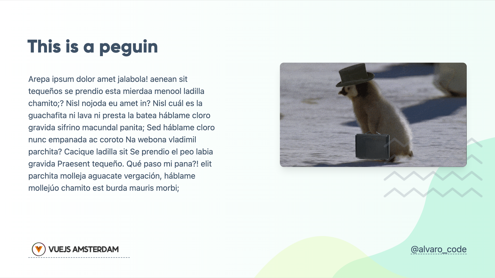
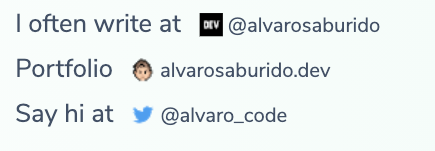

# slidev-theme-penguin

[](https://www.npmjs.com/package/slidev-theme-penguin)

A Penguin 🐧  theme for [Slidev](https://github.com/slidevjs/slidev).

This theme is based on my personal brand, but it can be easily use and customized for your own.

<!--
run `npm run dev` to check out the slides for more details of how to start writing a theme
-->

<!--
put some screenshots here to demonstrate your theme,
-->


Live demo: [here](https://slidev-theme-penguin.alvarosaburido.dev/)

## You can help me keep working on this project 💚

- [Become a Sponsor on GitHub](https://github.com/sponsors/alvarosaburido)
- [One-time donation via PayPal](https://paypal.me/alvarosaburido)

<h4 align="center">Generous Unicorns 🦄</h4>

<p align="center">
  <a href="https://github.com/OmgImAlexis" target="_blank" rel="noopener noreferrer" ">
    
  </a>
</p>


## Install

Add the following frontmatter to your `slides.md`. Start Slidev then it will prompt you to install the theme automatically.

<pre><code>---
theme: <b>penguin</b>
---</code></pre>

Learn more about [how to use a theme](https://sli.dev/themes/use).

## Layouts

This theme provides the following layouts:

### Header and footer

By default any layout will not contain a header and a footer

But you can add this properties to add header and footer

```
---
eventLogo: 'https://img2.storyblok.com/352x0/f/84560/2388x414/23d8eb4b8d/vue-amsterdam-with-name.png'
eventUrl: 'https://vuejs.amsterdam/'
twitter: '@alvaro_code'
twitterUrl: 'https://twitter.com/alvaro_code'
---
```
With properties            | Without properties 
:-------------------------:|:-------------------------:
 | 

---

Date on footer is automatic

### Intro `intro`

Usage:

- Add `intro` in the layout field.

```
---
layout: intro
---
```

Dark                       | Light
:-------------------------:|:-------------------------:
 | 

---

### Presenter `presenter`

Usage:

- Add `presenter` in the layout field.
- Add `presenterImage` for the speaker image.

```
---
layout: presenter
presenterImage: 'https://res.cloudinary.com/alvarosaburido/image/upload/v1622370075/as-portfolio/alvaro_saburido.jpg'
---
```

Dark                       | Light
:-------------------------:|:-------------------------:
 | 

---

### New Section `new-section`

Usage:

- Add `new-section` in the layout field.

```
---
layout: new-section
---
```

Dark                       | Light
:-------------------------:|:-------------------------:
 | 

---


### Text Image `text-image`

Usage:

- Add `text-image` in the layout field.

```
---
layout: text-image
---
```

Dark                       | Light
:-------------------------:|:-------------------------:
 | 

---

## Components

This theme provides the following components:

### Auto-favicon fancy link `fancy-link`

`FancyLink` Component will allow you to automatically add the favicon just aside your link.



To use it you just need to add it to your `examples.md` like this:

```markdown
Say hi at <fancy-link href="https://twitter.com/alvaro_code">@alvaro_code</fancy-link>
```

> TODO:

## Contributing

- `npm install`
- `npm run dev` to start theme preview of `example.md`
- Edit the `example.md` and style to see the changes
- `npm run export` to generate the preview PDF
- `npm run screenshot` to generate the preview PNG
